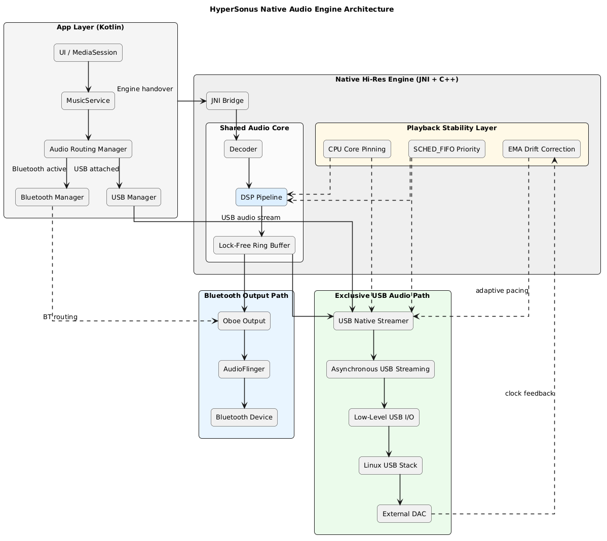
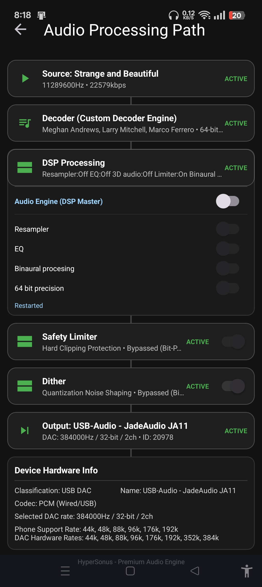
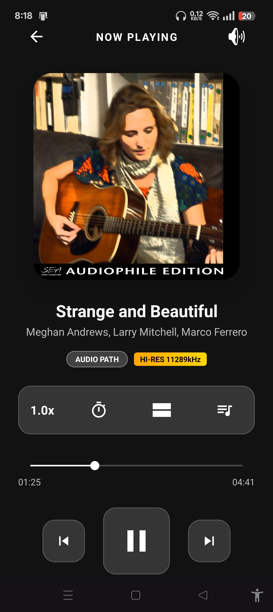

# HyperSonus: Hi-Res Bit-Perfect Audio Player

HyperSonus is a Low level high quality Android music player designed for Music artists, Music producers, and audiophiles who demand the highest possible audio fidelity. It bypasses conventional Android audio limitations through a custom-built native engine, offering true Bit-Perfect playback, advanced DAC integration, and a high-performance DSP pipeline.

# HyperSonus Technical Architecture

This document provides a deep-dive into the "Silicon-to-UI" architecture of the HyperSonus audio engine. It details the custom kernel-bypass drivers, the 64-bit DSP pipeline, and the asynchronous feedback mechanisms used to achieve bit-perfect high-resolution audio.

## System Architecture Diagram
The following diagram illustrates the data flow from the Android Application layer down to the USB DAC hardware, highlighting both the Shared (Bluetooth) and Exclusive (USB) pathways.

## Core Technical Pillars

### 1. High-Fidelity DSP Chain
All audio processing is performed in **64-bit double-precision floating point** to maintain a dynamic range far exceeding human hearing and the DAC's capabilities. 
- **Processing Order**: `DCBlock` -> `PreAmp` -> `10-Band EQ` -> `UltraSpatial / Resonance 3D` -> `PostAmp` -> `Limiter` -> `Dither`.
- **Dithering**: Uses a TPDF TPDF noise-shaping algorithm for transparent bit-depth reduction from 64-bit to the DAC's native format (24/32-bit).

### 2. Linux Kernel USBFS Driver
Bypassing the Android ALSA driver stack is achieved using the `usbfs` interface. 
- **Direct ioctl**: The engine uses `USBDEVFS_SUBMITURB` and `USBDEVFS_REAPURB` to manage isochronous data transfers manually.
- **Asynchronous Loop**: An asynchronous URB ring ensures that the DAC is always fed with data, even if the primary decoder thread is momentarily delayed.

### 3. Adaptive Rate Matching (EMA)
To account for clock drift between the Android device's crystal oscillator and the external DAC's clock:
- **Async Feedback**: The engine listens to the UAC2 Feedback endpoint.
- **EMA Algorithm**: An Exponential Moving Average filters the raw feedback data to calculate a stable, jitter-free target sample rate.
- **Micro-Scaling**: The streamer dynamically adjusts the number of samples per packet (e.g., sending 6.0001 samples on average) to keep the native ring buffer at an ideal 50% fill ratio.

### 4. Real-Time Hardening
To prevent audio clicks during system-wide activity:
- **Thread Priority**: The native engine thread is assigned `SCHED_FIFO` priority.
- **Core Affinity**: The engine utilizes to pin high-performance threads cpu pinning to the processor's core and with aquired Wakelock to ensure audio streaming over lock screen.

## Asynchronous Streaming Engine
HyperSonus achieves glitch-free, ultra-low-latency playback using a sophisticated **Asynchronous Multi-Threaded Architecture**:
1.  **JNI Bridge**: Acts as the high-speed gateway between the Kotlin and the C++ core. It orchestrates real-time callbacks.
2.  **HyperDecoder Thread**: A dedicated native thread running with **Real-Time Priority** and **CPU core affinity** (audio thread pinning)  to eliminate context-switching jitter during heavy system load.
3.  **Shared Ring Buffer**: A high-capacity asynchronous bridge that decouples production from consumption. It ensures glitch-free playback even during system-level interrupts.
4.  **Path-Specific Optimization**:
    *   **Bluetooth/Shared Path**: Pulls from the ring buffer into an **AAudio stream**, routing through the Android AudioFlinger mixer.
    *   **Exclusive USB Path**: Communicates directly with USB hardware. Bypasses the Android ALSA mixer entirely for true bit-perfect transmission.
---

## Core Philosophy: Bit-Perfect Audio & USB Exclusive Mode
Standard Android playback often resamples audio to 48kHz, degrading high-resolution source material. HyperSonus v6 introduces two high-fidelity paths:
- **USB Exclusive Mode (Bulk Engine)**: Built a custom USB driver that communicates directly with USB DACs bypassing the Android audio stack entirely for ultra-low jitter audio streaming.
- **Bit-Perfect (Oboe/AAudio)**: Requests **Exclusive Mode** to bypass the system mixer while using standard Android audio drivers.

---
## Architecture & Engineering
### 1. Multi-Engine Architecture
Hypersonus provides allowing the app to switch between three distinct backends:
- **Native Hi-Res Engine**: A Custom C++ Engine that handles 24-bit/32-bit audio decoding and low-latency output.
- **USB Exclusive Engine**: Direct-to-hardware streaming engine for mission-critical audiophile listening.

### 2. Intelligent Device Discovery & Management
- **USB DAC Probing**: Automatically detects connected USB DACs and probes their hardware-supported sample rates (achieved to 32 Bit 384kHz DoP).
- **Device Manager**: A built-in database of hardware-specific fixes for DACs to ensure stable playback across various USB controller implementations.
- **Advanced Bluetooth Detection**:  Identify high-quality codecs (LDAC, aptX HD, aptX Adaptive) and display real-time technical info (96kHz / 24-bit).

## 3. App Screenshots

  
  

---
## Advanced Features

### Audiophile DSP Pipeline
- **64-bit Double Precision Pipeline**: All DSP operations are performed in 64-bit precision to prevent rounding errors and preserve signal integrity before the final dithering stage.
- **10-Band Native Equalizer**: High-precision EQ available in the Native Hi-Res engine.
- **Quantization & Dither**: TPDF Dither with noise-shaping for transparent bit-depth reduction.
- **Safety Limiter**: Hard-clipping protection for the floating-point audio pipeline.
- **Pre-Amp Boost**: Adjustable gain control to match different headphone sensitivities.

### Real-Time Technical Insights
- **Interactive Audio Pathway**: A visual map showing the journey of your audio from Source -> Custom Engine -> Resampler -> DSP -> Limiter -> Dither -> Output.
- **Audiophile Technical Info**: Real-time display of engine type, output sample rate, channel count, and bit-perfect status.

### Library & Playback
- **Gapless Playback**: Seamlessly transitions between tracks without silence.
- **Folder-Based Navigation**: Robust folder picker and dedicated folder view for organized library browsing.
- **Smart Song Caching**: Efficient library indexing that avoids redundant scans.
- **Pause on Disconnect**: Automatically pauses playback when headphones or DACs are unplugged.
- **Background Stability**: Built-in prompts to bypass Android battery optimizations for uninterrupted listening sessions.

---

## License & Proprietary Status
**Proprietary License**: All rights reserved.

