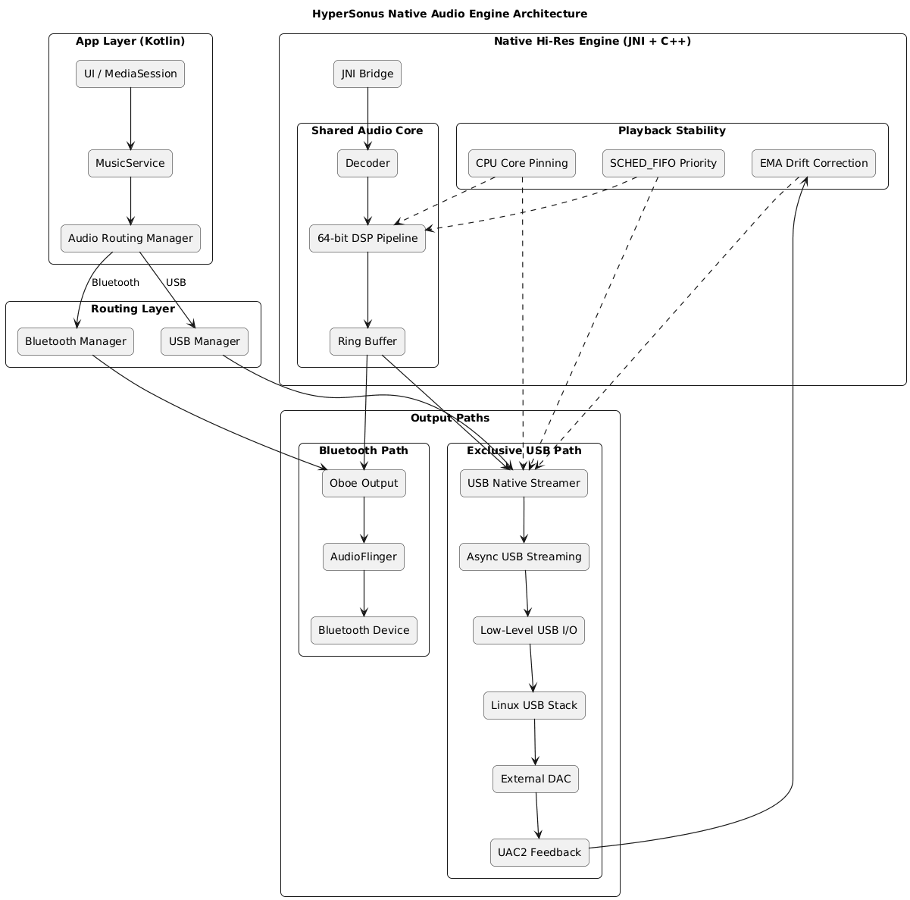

# HyperSonus Technical Architecture

This document provides a deep-dive into the "Silicon-to-UI" architecture of the HyperSonus audio engine. It details the custom kernel-bypass drivers, the 64-bit DSP pipeline, and the asynchronous feedback mechanisms used to achieve bit-perfect high-resolution audio.

## System Architecture Diagram

The following diagram illustrates the data flow from the Android Application layer down to the USB DAC hardware, highlighting both the Shared (Bluetooth) and Exclusive (USB) pathways.

## Core Technical Pillars

### 1. High-Fidelity DSP Chain
All audio processing is performed in **64-bit double-precision floating point** to maintain a dynamic range far exceeding human hearing and the DAC's capabilities. 
- **Processing Order**: `DCBlock` -> `PreAmp` -> `10-Band EQ` -> `UltraSpatial / Resonance 3D` -> `PostAmp` -> `Limiter` -> `Dither`.
- **Dithering**: Uses a TPDF TPDF noise-shaping algorithm for transparent bit-depth reduction from 64-bit to the DAC's native format (24/32-bit).

### 2. Linux Kernel USBFS Driver
Bypassing the Android ALSA driver stack is achieved using the `usbfs` interface. 
- **Direct ioctl**: The engine uses `USBDEVFS_SUBMITURB` and `USBDEVFS_REAPURB` to manage isochronous data transfers manually.
- **Asynchronous Loop**: An asynchronous URB ring ensures that the DAC is always fed with data, even if the primary decoder thread is momentarily delayed.

### 3. Adaptive Rate Matching (EMA)
To account for clock drift between the Android device's crystal oscillator and the external DAC's clock:
- **Async Feedback**: The engine listens to the UAC2 Feedback endpoint.
- **EMA Algorithm**: An Exponential Moving Average filters the raw feedback data to calculate a stable, jitter-free target sample rate.
- **Micro-Scaling**: The streamer dynamically adjusts the number of samples per packet (e.g., sending 6.0001 samples on average) to keep the native ring buffer at an ideal 50% fill ratio.

### 4. Real-Time Hardening
To prevent audio clicks during system-wide activity:
- **Thread Priority**: The native engine thread is assigned `SCHED_FIFO` priority.
- **Core Affinity**: The engine utilizes `cpu_set_t` to pin high-performance threads to the processor's "Big" cores, preventing the OS from migrating the thread to slower "Little" cores during a playback session.
